# PagerDuty-Zoom integration example

## Purpose

This project implements two functions:


*   Provides a destination for Zoom webhooks that can put participant joined / participant left notes in PagerDuty incidents when those events occur on a Zoom bridge that is being used as a PagerDuty conference bridge.
*   Provides a custom action that opens a new Zoom meeting for a PagerDuty incident.


## Requirements

Requirements:


*   Zoom account with developer rights/access
*   PagerDuty account
*   Heroku/AWS Lambda (or somewhere to host the script(s)) This document demonstrates the use of Heroku.


## Deploy App

Deploy App here ([https://github.com/martindstone/zoom-notes](https://github.com/martindstone/zoom-notes)) to your hosting location of choice. _If you are using Heroku, you will need to deploy this app to Heroku (heroku create). Verify that the heroku app is up (heroku ps) and then run (heroku info) to find the root URL of the Heroku deployment app. You will need this to enter an Event notification endpoint URL into your Zoom webhook app. _

In Heroku. There are five variables to set that the Python script uses. You can also hard code these variables in the script.

_If you are using Heroku, you will need to set the following config variables (instructions are later in document):_

**_FROM_EMAIL: the login email of the PagerDuty user that will be seen as posting the timeline entries on PD incidents_**

**_PD_KEY: A read/write v2 PagerDuty API key (in PagerDuty, go to Configuration > API Access > Create New API Key)_**

**_ZOOM_KEY: Zoom developer credentials: "API Key"_**

**_ZOOM_SECRET: Zoom developer credentials: "API Secret"_**

**_ZOOM_USERID: Your Zoom user ID, looks like "3Kxxxxxxxxxxxxxxxxxxx"_**


## Enable Zoom Webhooks

To Enable Zoom Webhooks

There are four webhooks specifically referenced and used in this documentation script:


*   Start Meeting
*   End Meeting
*   Host/Participant Joined Meeting
*   Host/Participant Left Meeting

There are many more available to use and configure for your specific needs. Login to Zoom Marketplace (marketplace.zoom.us) with an administrator account.

Click on Develop and select Build App

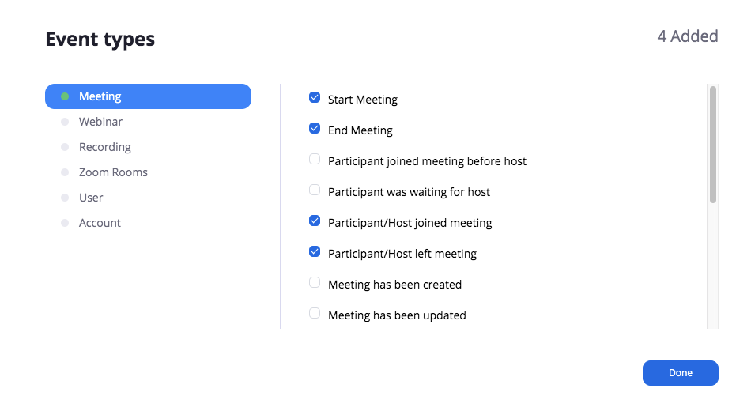


1. Enter an App Name
2. **Turn off** Intend to Publish the app…
3. Select Webhook only app

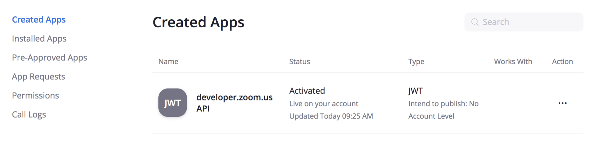


Enter Company Name, Name and Email Address

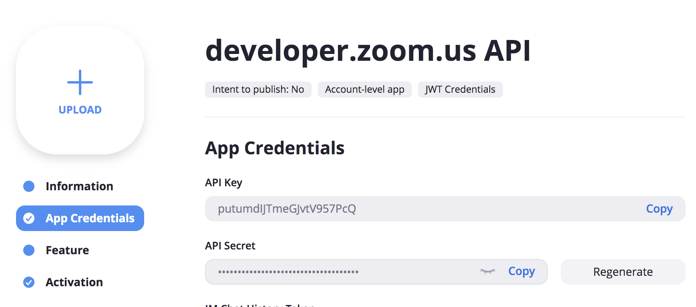


Click Continue

Enter an Event notification endpoint URL

_If using Heroku, you can find your Heroku endpoint by running (heroku info)._

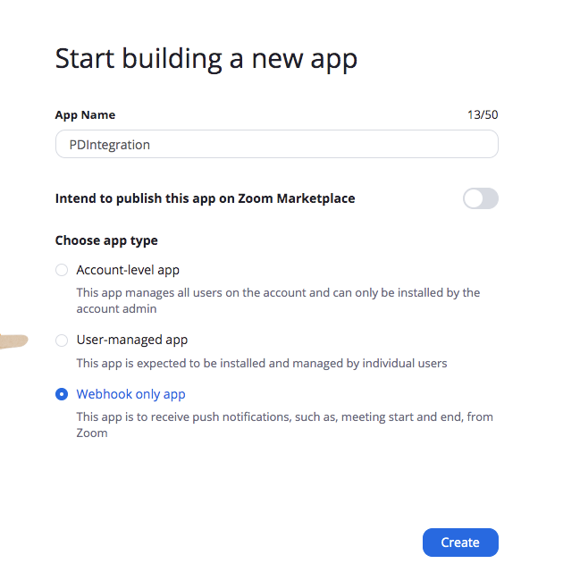


Click on Add Events

Select which events to add that you will use. For the script referenced with this documentation, there are four events used:

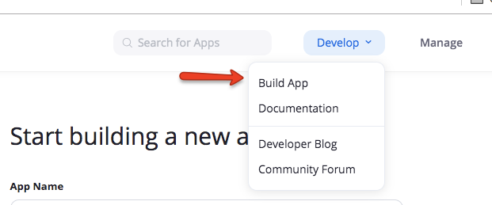


*   Click Done
*   Click Save
*   Click Continue

You have created an app in Zoom that opens the webhooks that you will be using with PagerDuty.


## Find Zoom Developer Credentials

Find your Zoom developer credentials \
Log into marketplace.zoom.us, click on Manage and find your API Developer app.

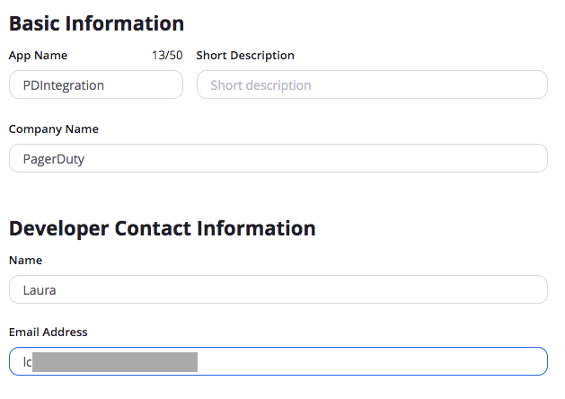


Open the app, select App Credentials:

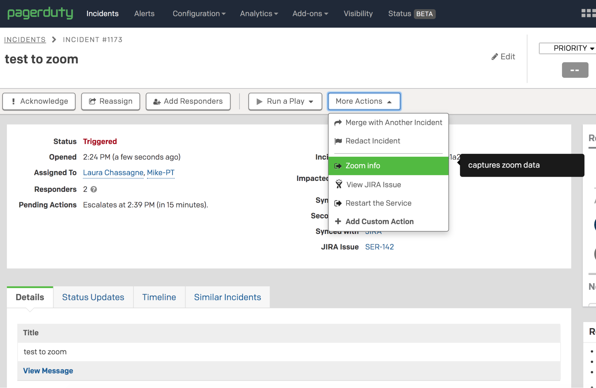


## Zoom User ID

Zoom User ID

To find your User ID - this is not easy. There are two ways to find this ID. Using Zoom’s Developer APIs online here:

[https://zoom-test-bed.docs.stoplight.io/api-reference/zoom-api/users/users](https://zoom-test-bed.docs.stoplight.io/api-reference/zoom-api/users/users)

To use Zoom’s Developer APIs,  you will need to generate an OAuth key. Once you have your oauth key, you can use it to List Users.

Open the OAuth app in your account. 

Add Scopes: user:read:admin and user:read

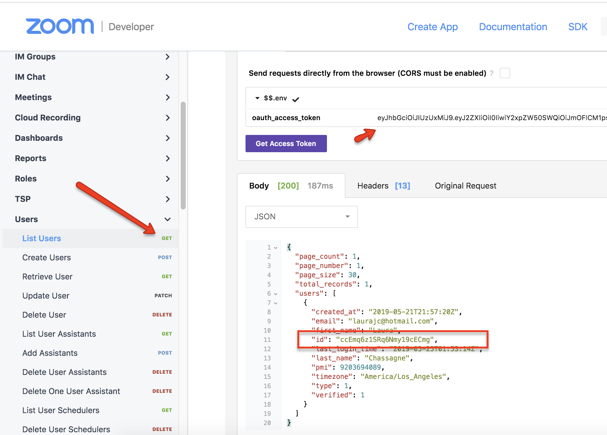


Use the developer client ID and client secret

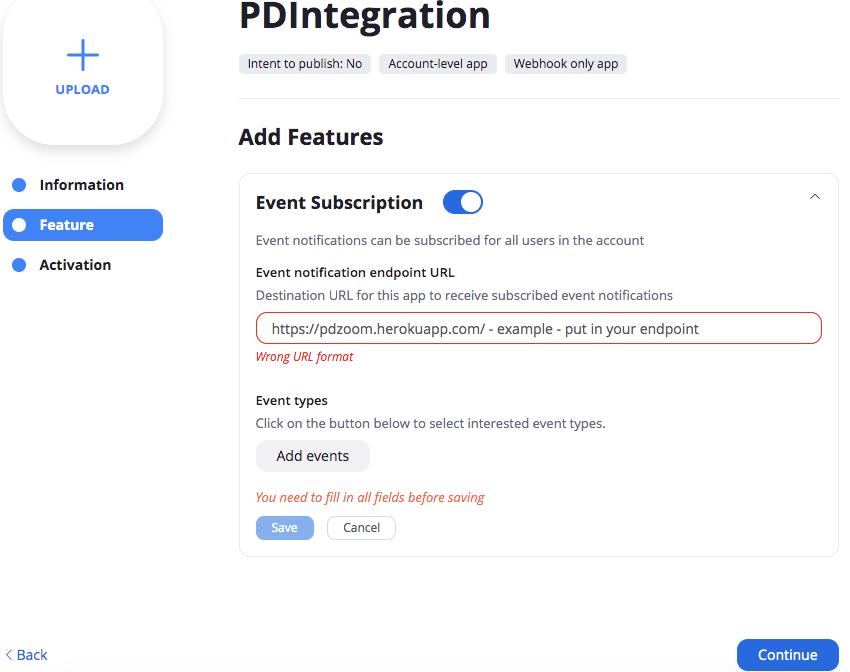

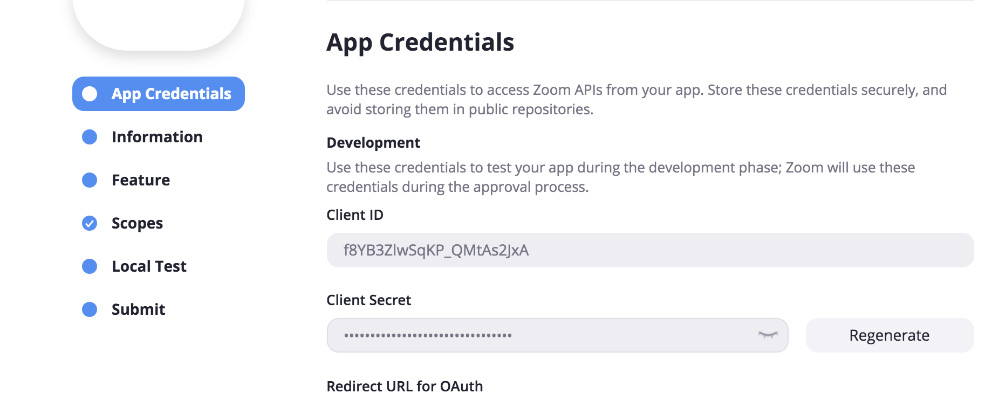


A second way to get your Client ID is to use a script that is part of the Heroku app previously created above. Script (listusers.py) is found here:

[https://github.com/martindstone/zoom-notes](https://github.com/martindstone/zoom-notes) 

To use it, set your ZOOM_KEY and ZOOM_SECRET first, like:


```
heroku config:set ZOOM_KEY="YOUR_ZOOM_KEY" ZOOM_SECRET="YOUR_ZOOM_SECRET"
```


and then run:


```
heroku run python listusers.py
```


You will get a list of user emails and Zoom ID's. Set ZOOM_USERID variable to the appropriate ID. 

At this point, whenever a participant joins or leaves a Zoom bridge that is set as the Conference Bridge for a PagerDuty incident, an appropriate note will be recorded on the incident.

Next, configure a custom action to create a Zoom bridge on demand from a PagerDuty incident:


1. **In PagerDuty**, go to Configuration > Extensions > Custom Incident Actions Extension
2. In the Custom Incident Actions page, click on the green button labeled New Action
3. Set an appropriate label and description for the action, like "Start Zoom"
4. Choose the PagerDuty services where you want this action to appear
5. For the URL Endpoint, fill in the heroku app's Web URL, followed by "start" - for example, of your heroku app is deployed at [https://<YourEndpointURL>.herokuapp.com](https://curious-wallaby.herokuapp.com/), fill in [https://<YourEndpointURL>.herokuapp.com/start](https://curious-wallaby.herokuapp.com/start)

Now you will be able to create a new Zoom bridge on demand from any PagerDuty incident.

To test

Create Incident on the Service where the custom action sits

Select your new Zoom Custom Action to run

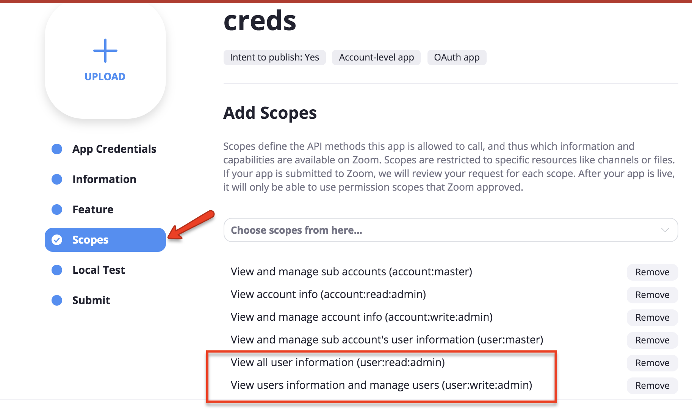
